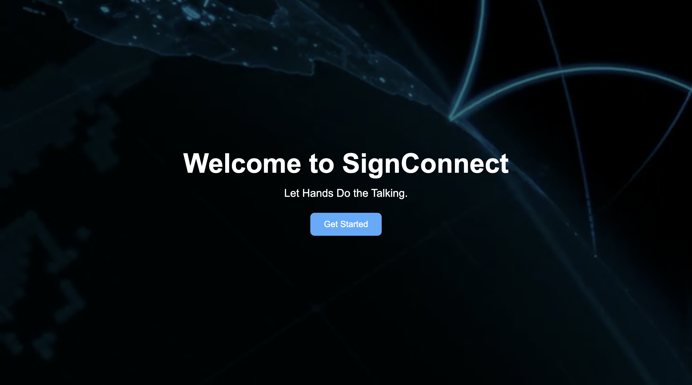
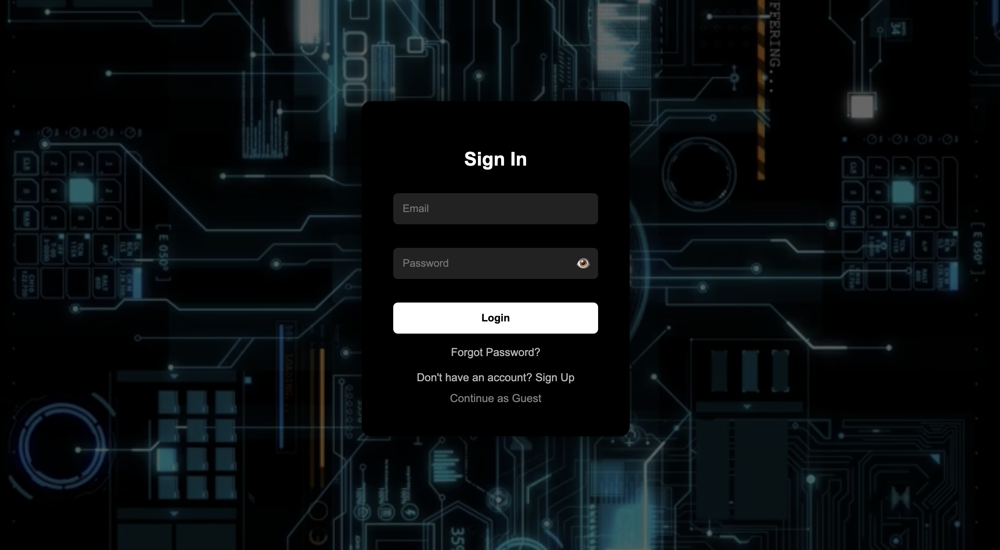
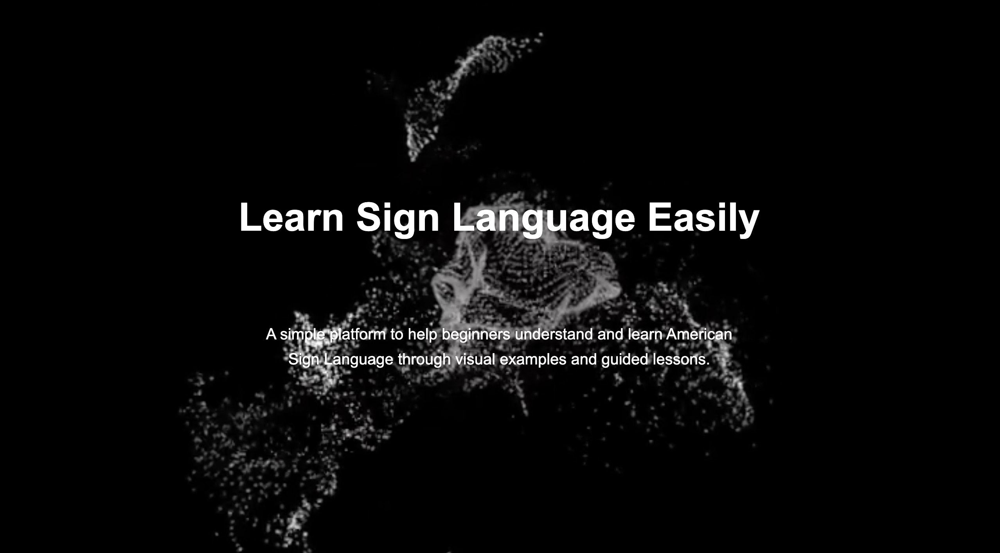
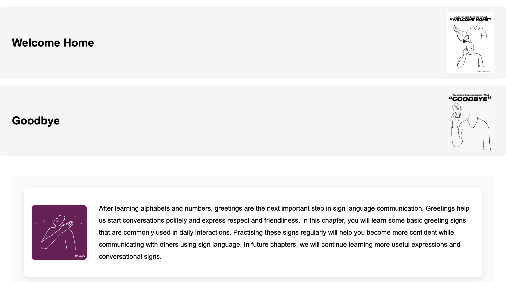
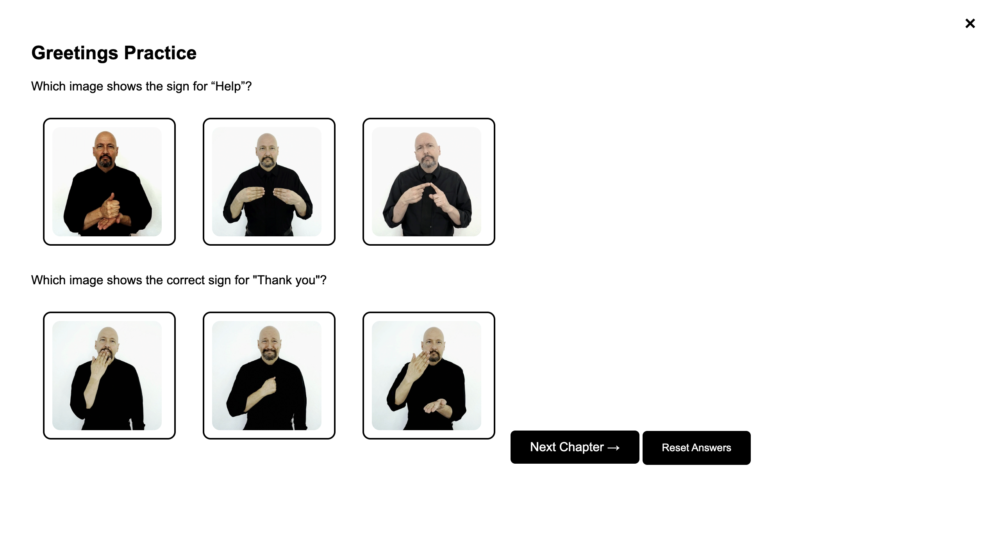
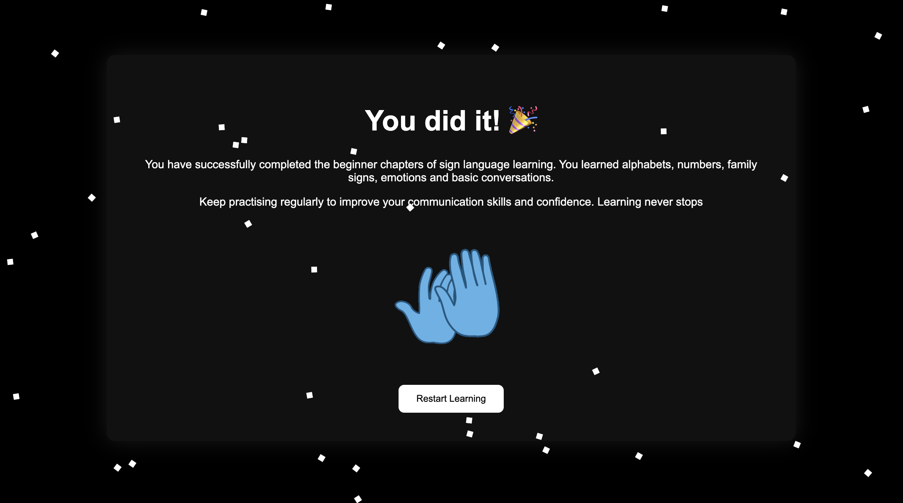

# SignConnect
A Sign Language Learning and Translation Website.

SignConnect is a web-based platform designed to make sign language learning more accessible and interactive. It helps users learn sign language through structured lessons and aims to bridge the communication gap between hearing and deaf communities.

## Features

- User-friendly interface
- Structured sign language learning modules
- Alphabet learning
- Number learning
- Daily words and common phrases
- Family and people signs
- Emotion signs
- Responsive design

## Technologies Used

- HTML5
- CSS3
- JavaScript

## Project Status

This project is actively under development. The current version includes a responsive user interface and structured learning modules. Future updates will integrate AI-powered translation and interactive learning features.

## Future Scope

- AI-based text-to-sign translation
- Sign-to-text recognition
- User authentication
- Progress tracking
- Interactive quizzes
- Accessibility improvements

## Demo Video

## Screenshots

### Home / Landing Page

### Login Page

### Main Website

### Greeting Page

### Practice Page

### End Page

## Author

**Yana Anand**

B.Tech CSE (AI & ML)

Chitkara University
